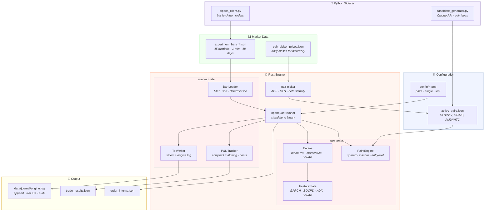

# OpenQuant

A research-first quantitative trading system. Rust core engine, Python sidecar, pairs trading focus.

## Quick Start

```bash
# Build and run pairs trading
./run.sh pairs

# Check results
./run.sh summary

# View status
./run.sh status

# Tail logs
./run.sh logs
```

## Architecture



### Directory Layout

```
config/             ← TOML configs per mode (pairs, single, test)
data/               ← bar data, pair configs, journal logs
engine/crates/
  core/             ← spread computation, z-scores, entry/exit, risk
  runner/           ← standalone binary, bar loading, P&L, logging
  pair-picker/      ← statistical pair validation (ADF, OLS, beta)
  pybridge/         ← PyO3 bridge (optional)
paper_trading/      ← Python sidecar: Alpaca API, bar fetching
```

## Trading Modes

| Mode | Config | Description |
|------|--------|-------------|
| `pairs` | `config/pairs.toml` | Pairs trading only (GLD/SLV, GS/MS, AMD/INTC) |
| `single` | `config/single.toml` | Single-symbol mean-reversion + momentum |
| `test` | `config/test.toml` | Integration testing (pairs, no stale bar check) |

```bash
./run.sh pairs          # default
./run.sh single
./run.sh test
```

## Key Design Decisions

- **Rust-first**: All math, statistics, and trading logic in Rust. Python only for external APIs (Alpaca)
- **Deterministic**: Bars sorted by `(timestamp, symbol)`. Same config = same results every time
- **No overnight risk**: `last_entry_hour=14` blocks entries after 14:00 ET
- **Persistent logs**: `data/journal/engine.log` appends across runs with `run_id=git_commit-timestamp`
- **Config separation**: Pair identity (from JSON) vs trading params (from TOML)
- **Clean builds**: `./run.sh` always rebuilds from clean to avoid stale binaries

## Core Tenets

### Discipline
Research system first, trading system second. No strategy goes live without: observation → hypothesis → backtest → OOS validation → paper trade.

### Mathematics
Every decision reduces to measurable quantities. All evaluation is net of costs. Movement is judged relative to volatility. Complexity is earned after simpler math shows signal.

### Truth
- Backtests are filters, not proof
- Losses are logged clearly, never hidden
- The system discovers truth, not manufactures confidence

### Survival
- Risk management is the main strategy
- A dead strategy cannot improve

## Build Commands

```bash
./run.sh build          # clean build
./run.sh pairs          # build + run pairs
./run.sh clean          # clean artifacts + logs
./run.sh summary        # last run P&L
./run.sh status         # git, pairs, configs overview
./run.sh logs           # tail engine.log

# Manual
cd engine && cargo test --workspace
cd engine && cargo bench -p pair-picker
```

## Logging

Every run appends to `data/journal/engine.log` with:
- **Run ID**: `git_commit-timestamp` (maps logs to code)
- **Startup**: full config dump, pairs loaded, market hours
- **Every trade**: ENTRY/EXIT with timestamp, prices, z-score, bars held
- **P&L**: gross/net bps, dollar amount, exit reason
- **Summary**: total trades, win rate, $/day

```
grep "run_id=70d94da" data/journal/engine.log    # isolate one run
grep "STOP LOSS" data/journal/engine.log          # find risk events
grep "P&L summary" data/journal/engine.log        # all run summaries
```
